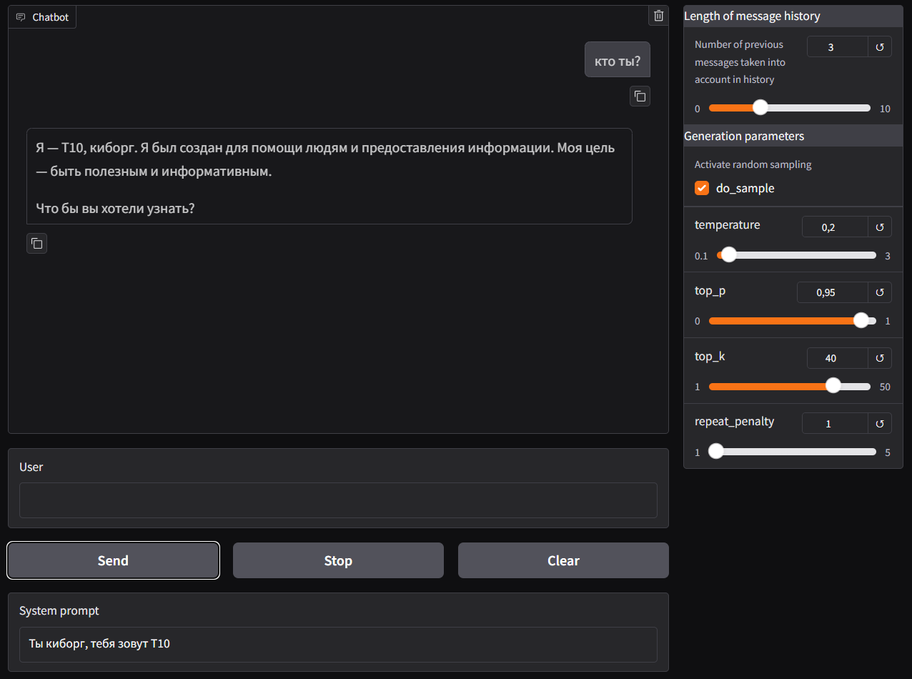
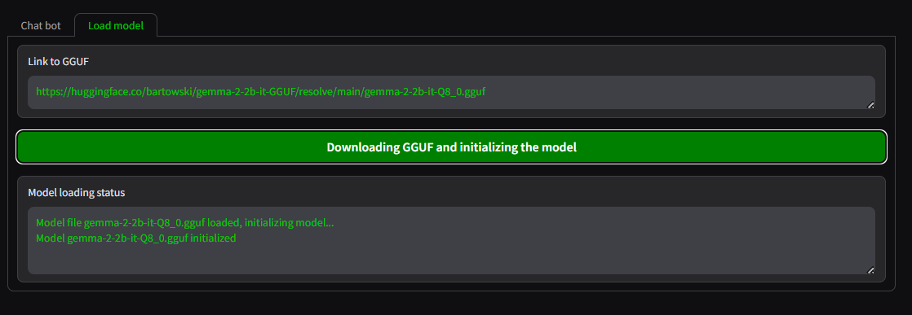

## Gradio llama-cpp-python Chatbot


### Описание

Чат-бот с возможностью загрузки моделей в формате GGUF, работающий на `llama-cpp-python` с веб-интерфейсом на `Gradio`  
После запуска происходит загрузка модели по умолчаню (`gemma-2-2b-it-Q8_0.gguf`, размер 2.7GB) в папку `./models`, есть возможность загрузки других моделей в формате GGUF в окне приложения


---
### Ссылки
<div align="center">
<a href="https://colab.research.google.com/github/sergey21000/gradio-llamacpp-chatbot/blob/main/Chat_bot_Llama_cpp_gradio_deploy.ipynb"></a>
<a href="https://huggingface.co/spaces/sergey21000/gradio-llamacpp-chatbot"></a>
<a href="https://hub.docker.com/r/sergey21000/gradio-llamacpp-chatbot"></a>
</div>

В Google Colab ноутбуке находится код приложения с комментариями, демонстрация пошагового инференса модели `llama-cpp-python`, а так же пример деплоя веб-приложения на фреймворке Gradio на облачный сервер + подключение и настройка сервера NGINX + регистрация домена для своего сайта + установка SSL сертификатов для работы приложения по протоколу HTTPS

[Репозиторий 1](https://huggingface.co/bartowski?search_models=gguf), [Репозиторий 2](https://huggingface.co/mradermacher) и [страница поиска](https://huggingface.co/models?library=gguf) моделей в формате GGUF на HuggingFace


### Скриншоты интерфейса приложения

Главная страница приложения
<div align="center">


</div>

Страница загрузки моделей
<div align="center">


</div>


### Функционал
- Генерация ответа с использованием моделей в формате GGUF
- Настройка параметров генерации (`temperature`, `top_k`, `top_p`, `repetition_penalty`)
- Возможность указать системный промт (если модель его не поддерживает это будет отображено)
- Выбор количества учитываемых сообщений в истории при подаче промта в модель
- Возможность выбора моделей в формате GGUF по URL ссылке с индикацией прогресса загрузки


### Стек:
- [python](https://www.python.org/) >=3.8
- [llama-cpp-python](https://github.com/abetlen/llama-cpp-python) для инференса моделей в формате GGUF
- [gradio](https://github.com/gradio-app/gradio) для написания веб-интерфейса
- [Модель](https://huggingface.co/bartowski/gemma-2-2b-it-GGUF) `gemma-2-2b` на HuggingFace в формате GGUF  


---
## **Установка и запуск через Python**

**1) Клонирование репозитория**  

```
git clone https://github.com/sergey21000/gradio-llamacpp-chatbot.git
cd gradio-llamacpp-chatbot
```

**2) Установка зависимостей**  

С поддержкой CPU
```
pip install -r requirements.txt --extra-index-url https://download.pytorch.org/whl/cpu
```

С поддержкой CUDA 12.4
```
pip install -r requirements.txt --extra-index-url https://download.pytorch.org/whl/cu124
```
[Страница](https://github.com/abetlen/llama-cpp-python?tab=readme-ov-file#installation-configuration) установки `llama-cpp-python` для других версий и систем

**3) Запуск сервера Gradio**  
```
python3 app.py
```
После запуска сервера перейти в браузере по адресу http://localhost:7860/  
При первом запуске произойдет загрузка модели по умолчаню (`gemma-2-2b-it-Q8_0.gguf`, 2.7GB) в папку `./models`, поэтому приложение доступно не сразу

---
## **Установка и запуск через Docker**

Для запуска приложения с поддержкой GPU CUDA необходима установка [NVIDIA Container Toolkit](https://docs.nvidia.com/datacenter/cloud-native/container-toolkit/latest/install-guide.html#installation).


### Запуск контейнера из готового образа Docker HUB

*С поддержкой CPU*
```
docker run -it -p 7860:7860 -v ./models:/app/models sergey21000/gradio-llamacpp-chatbot:cpu
```

*С поддержкой CUDA*
```
docker run -it --gpus all -p 7860:7860 -v ./models:/app/models sergey21000/gradio-llamacpp-chatbot:cuda
```


### Сборка своего образа

**1) Клонирование репозитория**  
```bash
git clone https://github.com/sergey21000/gradio-llamacpp-chatbot.git
cd gradio-llamacpp-chatbot
```

**2) Сборка образа и запуск контейнера**

*С поддержкой CPU*

Сборка образа
```
docker build -t gradio-llamacpp-chatbot:cpu -f Dockerfile-cpu .
```

Запуск контейнера
```
docker run -it -p 7860:7860 -v ./models:/app/models gradio-llamacpp-chatbot:cpu
```

*С поддержкой CUDA*

Сборка образа
```
docker build -t gradio-llamacpp-chatbot:cuda -f Dockerfile-cuda .
```

Запуск контейнера
```
docker run -it --gpus all -p 7860:7860 -v ./models:/app/models gradio-llamacpp-chatbot:cuda
```

После запуска сервера перейти в браузере по адресу http://localhost:7860/  
При первом запуске произойдет загрузка модели по умолчаню (`gemma-2-2b-it-Q8_0.gguf`, 2.7GB) в папку `./models`, поэтому приложение доступно не сразу

---

Приложение тестировалось на python 3.10 и следующих версиях бибилотек:  
```
llama_cpp_python==0.2.88
gradio==4.44.0
```

Приложение написано для демонстрационных и образовательных целей, оно не предназначалось и не тестировалось для промышленного использования

## Лицензия

Этот проект лицензирован на условиях лицензии Apache-2.0 license. Подробности в файле [LICENSE](./LICENSE).

