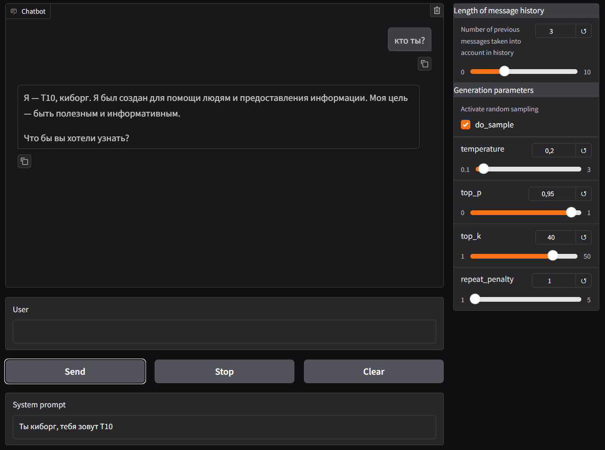

# Gradio llama.cpp Chatbot

**Чат-бот на `llama.cpp` с веб-интерфейсом на `Gradio`**


## 📋 Содержание

- 📽 [Демонстрация](#-Демонстрация)
- 🖼 [Скриншоты](#-Скриншоты)
- 🚀 [Функционал](#-Функционал)
- 🏗 [Стек Технологий](#-Стек-технологий)
- 🐍 [Установка и запуск через Python](#-Установка-и-запуск-через-Python)
- 🐳 [Установка и запуск через Docker](#-Установка-и-запуск-через-Docker)
  - 🏃‍ [Запуск контейнера из образа Docker](#-Запуск-контейнера-из-образа-Docker)
  - 🏗 [Сборка своего образа и запуск контейнера](#-Сборка-своего-образа-и-запуск-контейнера)
- 📱 [Установка и запуск на Android](#-Установка-и-Запуск-на-Android)


## 📽 Демонстрация

<div align="center">
<a href="https://huggingface.co/spaces/sergey21000/gradio-llamacpp-chatbot"></a>
</div>

В Google Colab <a href="https://colab.research.google.com/drive/1tClehCQILXLSXYqIZII569S1eTWnf8hZ"></a> ноутбуке дополнительно реализовано:  
 - Код приложения с комментариями
 - Демонстрация пошагового инференса моделей через `llama-cpp-python`
 - Пример деплоя веб-приложения на фреймворке Gradio на облачный сервер
 - Подключение и настройка сервера NGINX 
 - Регистрация домена для своего сайта
 - Установка SSL сертификатов для работы приложения по протоколу HTTPS на своем сайте


## 🖼 Скриншоты

<details>
<summary>Главная страница приложения</summary>


</details>


## 🚀 Функционал

- Генерация ответа с использованием моделей в формате GGUF
- Поддержка мультимодальности (изображения)
- Настройка параметров генерации (`temperature`, `top_k`, `top_p`, `repetition_penalty`)
- Возможность указать системный промт
- Выбор количества учитываемых сообщений в истории при подаче промта в модель
- Возможность включать/отключать и выводить/не выводить размышления модели если она его поддерживает
- Возможность выбора моделей в формате GGUF перед запуском

Где искать LLM модели в формате GGUF
- [bartowski](https://huggingface.co/bartowski) 
- [mradermacher](https://huggingface.co/mradermacher) 
- [Поиск на HuggingFace](https://huggingface.co/models?pipeline_tag=text-generation&library=gguf&sort=trending)


## 🏗 Стек Технологий

- [python](https://www.python.org/) >= 3.10
- [llama-cpp-py](https://github.com/sergey21000/llama-cpp-py) запуск [llama.cpp](https://github.com/ggml-org/llama.cpp) сервера для инференса моделей в формате GGUF
- [gradio](https://github.com/gradio-app/gradio) для написания веб-интерфейса
- [Модель gemma-3-1b](https://huggingface.co/bartowski/google_gemma-3-1b-it-GGUF) `google_gemma-3-1b-it-Q8_0.gguf` в формате GGUF в качестве LLM модели по умолчанию


Работоспособность приложения проверялась на следующих ОС и версиях Python
- Ubuntu 22.04, python 3.12, CUDA 12.5 (Google Colab)
- Windows 10, python 3.12, CUDA 13.1
- Android 11 (MIUI 12), Termux, python 3.12
- Android 11 (MIUI 12), Ubuntu 22.04 (Andronix), python 3.10


## 🐍 Установка и запуск через Python

**1) Клонирование репозитория**  
```sh
git clone https://github.com/sergey21000/gradio-llamacpp-chatbot.git
cd gradio-llamacpp-chatbot
```

Выбор моделей и другие настройки производятся в файле `.settings.env`

**2) Установка зависимостей**  
```sh
pip install -r requirements.txt
```

**3) Запуск**  
```sh
python app.py
```

После запуска сервера перейти в браузере по адресу http://127.0.0.1:7860/  

Запуск тестов
```
pytest -vs
```


## 🐳 Установка и запуск через Docker Compose

> [!NOTE]  
Для запуска приложения с поддержкой GPU CUDA необходима установка [NVIDIA Container Toolkit](https://docs.nvidia.com/datacenter/cloud-native/container-toolkit/latest/install-guide.html#installation).


**1) Клонирование репозитория**  
```sh
git clone https://github.com/sergey21000/gradio-llamacpp-chatbot.git
cd gradio-llamacpp-chatbot
```

Выбор моделей и другие настройки производятся в файле `.settings.env`

**2) Запуск Compose**

*Запуск с поддержкой CPU*
```sh
docker compose -f docker/compose.cpu.yml up
```

*Запуск с поддержкой CUDA*
```sh
docker compose -f docker/compose.cuda.yml up
```

Веб-интерфейс сервера доступен по адресу  
http://127.0.0.1:7860/  


---
<ins><b>Дополнительно</b></ins>

Можно заранее указать файл `compose` по умолчанию и запускать короткой командой
```sh
# установка переменной окружения (вариант для Linux)
export COMPOSE_FILE=docker/compose.cpu.yml

# установка переменной окружения (вариант для Windows PowerShell)
$env:COMPOSE_FILE="docker/compose.cpu.yml"

# запуск короткой командой
docker compose up
```


## 📱 Установка и запуск на Android

[Инструкции](https://github.com/sergey21000/gradio-llamacpp-chatbot/blob/main/README_Android.md) по запуску бота на Android


## Лицензия

Этот проект лицензирован на условиях лицензии [MIT](./LICENSE).
