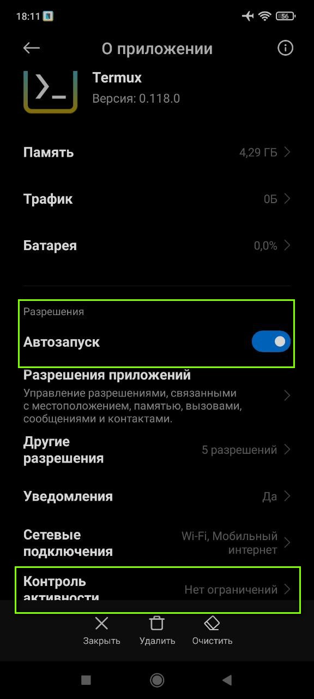
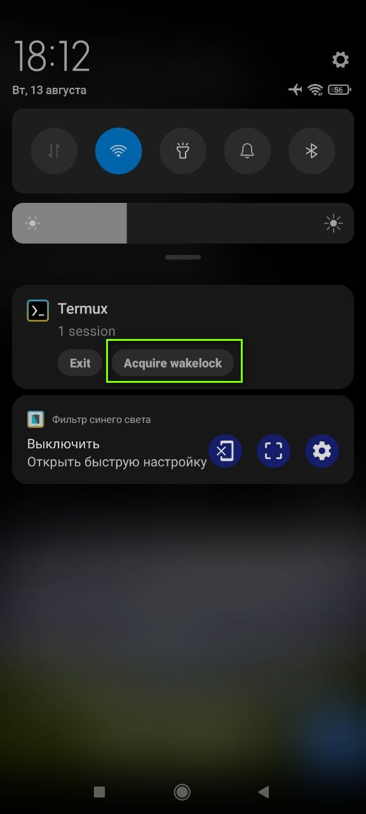
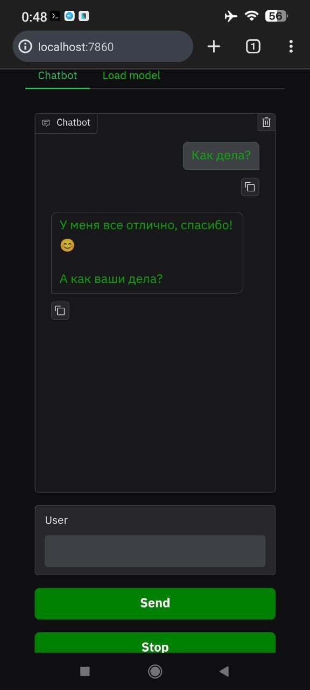
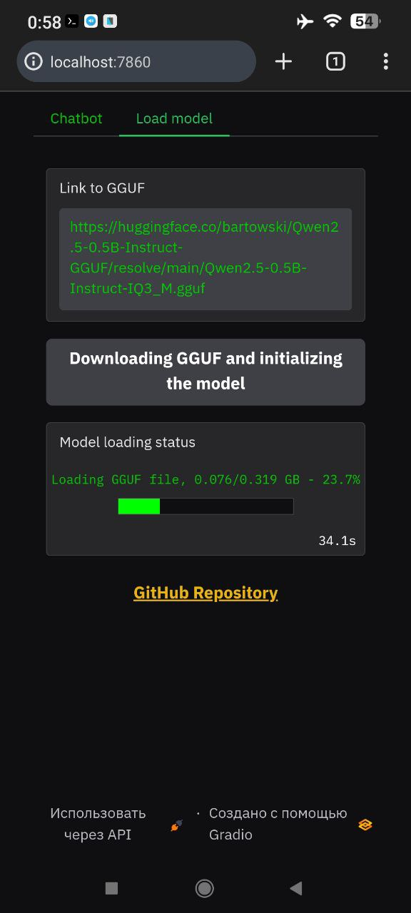
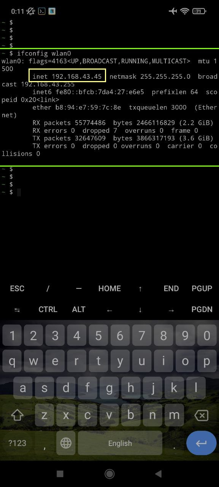
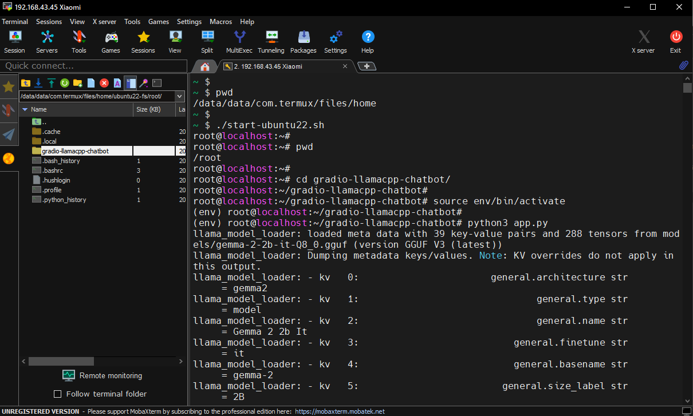

---
# 📱 Запуск бота на Android


---
# 📋 Содержание

- [Установка Termux и Ubuntu на Android](#Установка-Termux-и-Ubuntu-на-Android)
- [Установка Python на Ubuntu и запуск приложения](#Установка-Python-на-Ubuntu-и-запуск-приложения)
- [Дополнительно](#Дополнительно)
  - [Подключение из ПК к телефону по SSH через терминал](#Подключение-из-ПК-к-телефону-по-SSH-через-терминал)
  - [Подключение из ПК к телефону по SSH через MobaXterm](#Подключение-из-ПК-к-телефону-по-SSH-через-MobaXterm)
  - [Ссылки](#Ссылки)

---
## 1 Установка Termux и Ubuntu на Android

**1) Загрузить и установить `Termux`**  

Загрузить `apk` файл с [GitHub](https://github.com/termux/termux-app/releases ) или [Fdroid](https://f-droid.org/ru/packages/com.termux/)

После установки `Termux` долгий тап на значок `Termux` - Инфо о приложении - Разрешения - поставить разрешение на доступ к памяти (или сделать все это в Настройки - приложения)

**2) Выполнить команду чтобы дать доступ `Termux` к памяти телефона**

Запустить `Termux` и выполнить команду
```
termux-setup-storage
```

Проверить что `Termux` имеет доступ к памяти телефона
```
ls /sdcard
```
Если нет - отозвать и снова дать доступ к памяти телефона вручную, как описано в шаге 1

**3) Установить программу `Andronix`, которая установит `Ubuntu` на `Android`**  

Загрузить и установить `Andronix` c [Play Market](https://play.google.com/store/apps/details?id=studio.com.techriz.andronix), [GitHub](https://github.com/AndronixApp/AndronixOrigin/releases) или [4PDA](https://4pda.to/forum/index.php?showtopic=972503)
 
**4) Запуск `Andronix`**, выбор `Linux Distribution`, выбор `Ubuntu`, выбор `22.04`, выбор `CLI Only`.  
Произойдет копирование текстовой команды для установки `Ubuntu` в буфер обмена  

**5) Запуск `Termux`**, долгий тап по экрану - вставить скопированную команду, нажать `Enter`, начнется установка `Ubuntu` 

Например для установки Ubuntu 22.04 это будет следующая команда
```
pkg update -y && pkg install wget curl proot tar -y && wget \
https://raw.githubusercontent.com/AndronixApp/AndronixOrigin/master/Installer/Ubuntu22/ubuntu22.sh -O \
ubuntu22.sh && chmod +x ubuntu22.sh && bash ubuntu22.sh
```
После установки `Termux` автоматически перейдет в `Ubuntu`, о чем будет сигнализировать надпись в терминале  
`root@localhost: `  

> [!NOTE]  
Если нужно потом вручную запускать `Ubuntu`, нужно просто ввести в Termux `./start-ubuntu22.sh`, этот скрипт появляется после установки `Ubuntu` (если ставили другую ОС то будет называться соотвественно)  
Чтобы выйти из `Ubuntu` обратно в `Termux` - ввести `exit`  
Сама папка с `Ubuntu` лежит там же где и скрипт, в папке  
`/data/data/com.termux/files/home/ubuntu22-fs/`

`Ubuntu` запущена и готова к работе, можно ставить необходимые пакеты, например `apt install nano`  

<ins><b>Все дальнейшие команды вводить в `Ubuntu`</b></ins>


---
## Установка Python на Ubuntu и запуск приложения

**1) Установка Python и дополнительных библиотек на Ubuntu**  

Команды для установки `Python` и необходимых библиотек на `Ubuntu`
```
apt update
apt install python3 python3-pip python3-venv git nano wget
pip install --upgrade pip
```
Для `Ubuntu 22.04` устанавливается версия Python 3.10.12  

**2) Перенос папки проекта на Android и запуск приложения**

> [!NOTE]  
Создать виртуальное окружение можно только в директориях `Ubuntu` (в памяти телефона `/sdcard` нельзя)  
Создавать виртуальное окружение необязательно

<ins><b>Вариант 1</b></ins> клонировать репозиторий через Git в текущее расположение `/root` (либо создать пользователя в `Ubuntu` и работать с домашней директорией пользователя)  
```
git clone https://github.com/sergey21000/gradio-llamacpp-chatbot.git
python3 -m venv env
source env/bin/activate
pip install -r requirements.txt
python3 app.py
```

<ins><b>Вариант 2</b></ins> перекинуть папку с приложением на телефон (например через кабель)  
Удобно когда нужно быстро поменять модель в папке `model` с помощью ПК и кабеля, но данный способ не работает с виртуальным окружением  

В данном примере в основной папке телефона `\sdcard` создана папка `python` и в ней лежит папка приложения `gradio-llamacpp-chatbot`
```
cd /sdcard/python/gradio-llamacpp-chatbot/
pip install -r requirements.txt
python3 app.py
```

<ins><b>Вариант 3</b></ins> такой же как предыдущий но с виртуальным окружением  
Подключаем телефон к ПК, перекидываем в папку `/sdcard` папку с приложением (`gradio-llamacpp-chatbot`) и перемещаем ее в корневую директорию `Ubuntu` через терминвал командой `mv`
```
mv -v /sdcard/gradio-llamacpp-chatbot ./gradio-llamacpp-chatbot
cd gradio-llamacpp-chatbot
python3 -m venv env
source env/bin/activate
pip install -U pip
pip install -r requirements.txt
python3 app.py
```

<ins><b>Вариант 4</b></ins> подключиться к телефону по SSH через ПО, например MobaXterm и перекинуть папку с приложением через файловый менеджер  
Удобно при работе через MobaXterm, поскольку по умолчанию он открывается в папке `/data/data/com.termux/files/home`, и виртуальное окружение с данным способом работает

В данном примере папка с приложением `gradio-llamacpp-chatbot` перенесена через файловый менеджер MobaXterm в корневую директорию Termux
```
cd /data/data/com.termux/files/home
python3 -m venv env
source env/bin/activate
pip install -U pip
pip install -r requirements.txt
python3 app.py
```

Перейти с любого браузера телефона по адресу `http://localhost:7860` 

Для остановки приложения ввести Ctrl + C  
Чтобы выйти из `Ubuntu` обратно в `Termux` - в терминале ввести `exit`  
Чтобы заново открыть `Ubuntu` из `Termux` - в терминале ввести `./start-ubuntu22.sh`  


**3) Настроить Android чтобы он не закрывал `Termux` (опционально, для случая если приложение будет деплоиться на телефоне)**

Для этого в зависимости от версии Android нужно найти все настройки, которые отвечают за закрытие приложения системой Android (оптимизация батареи, настройка работы программ в фоновом режиме)  
Например на Android 11 (MIUI 12) нужно удерживать тап на `Termux` - О приложении, включить автозапуск и установить Констроль активности - Без ограничений  

<details>
<summary>Скриншот Настроек Контроля активности</summary>

</details>

Так же в шторке уведомлений Android там где висит `Termux` нужно нажать `Acquire wakelock`, переключив таким образом `Termux` в режим в котором он не будет отключаться    
Еще можно нажать на недавние приложения - тап на окошко `Termux` и нажать на замок чтобы закрепить приложение  

<details>
<summary>Скриншот Acquire wakelock Termux</summary>

</details>


<details>
<summary>Запуск Ubuntu из терминала Termux и запуск приложения</summary>

</details>

<details>
<summary>Открытие приложения а браузере и диалог с `gemma-2-2b-it-Q8_0.gguf` (2.7 Gb)</summary>

</details>

<details>
<summary>Страница загрузки моделей GGUF</summary>

</details>


---
## Дополнительно


---
### Подключение из ПК к телефону по SSH через терминал

**Подключение из ПК к телефону по SSH через терминал**  

[Документация](https://wiki.termux.com/wiki/Remote_Access) и [статья](https://axenov.dev/termux-настроить-доступ-по-ssh-между-android-и-ubuntu/) по удаленному подключению к `Termux` 

> [!NOTE]  
Пк и телефон должны быть подключены к одной сети  
IP адрес телефона может динамически меняться при новых подключениях  

**1) Установка SSH и редактора nano на `Termux`**
```
pkg install nano openssh
```

**2) Генерация SSH ключей на ПК**
```
ssh-keygen
```
Далее нажимать `Enter` пока не будет написано что ключи сгенерированы  
Ключи представляют из себя публичную `id_rsa.pub` и приватную `id_rsa` части  
Приватный ключ никому не надо показывать, публичный ключ можно показывать кому угодно и его содержимое нужно будет скопировать на телефон  
Ключи сохраняются на Windows по пути `C:\Users\ИМЯ_ПОЛЬЗОВАТЕЛЯ\.ssh\`  
Ключи сохраняются на Linux по пути `~/.ssh/`  

**3) Вывести содержимое публичного ключа `id_rsa.pub` на ПК**
 - Windows
```
cat %USERPROFILE%\.ssh\id_rsa.pub
```
 - Linux
```
cat ~/.ssh/id_rsa.pub
```

**4) Скопировать содержимое ключа и любым удобным способом перекинуть на телефон (например через Избранное Telegram)**  
Затем в телефоне скопировать содержимое и вставить его в файл `~/.ssh/authorized_keys` в телефоне  
Для этого в терминале `Termux` открываем редактор nano
```
nano ~/.ssh/authorized_keys
```
Удерживаем тап по экрану - вставляем содержимое, и с помощью клавиатуры `Termux` нажимаем `Ctrl+S` и `Ctrl+X`

**5) Остановка и запуск службы SSH в `Termux`**
```
pkill sshd
sshd
```

**6) Узнать IP адрес телефона Android**
```
ifconfig
```
IP адрес написан в разделе `wlan0`, после слова `inet`, например `192.168.43.45`  
Название может быть другое, например `wlan1` и тд  
Можно сразу посмотреть инфо о `wlan0` командой
```
ifconfig wlan0
```

**7) Подключение из ПК с телефону - к IP адресу который узнали командой выше**
```
ssh 192.168.43.45 -p 8022
```
Если появится предложение ввести имя пользователя (`login as:`) - оставить пустым и нажать `Enter`

Перед подключением убедиться что служба SSH в `Termux` запущена (нужно запускать ее при каждом перезапуске `Termux`)
```
sshd
```

**8) Отключить авторизацию по паролю в `Termux` чтобы можно было подключаться только через SSH (опционально)**  
```
nano $PREFIX/etc/ssh/sshd_config
```
Добавить или редактировать строку
```
PasswordAuthentication no
```

*Дополнительные команды*  

Отключиться от телефона
```
exit
```
Завершить работу службы SSH в `Termux`
```
pkill sshd
```

<details>
<summary>Скриншот команды `ifconfig wlan0` с IP адресом телефона</summary>

</details>


---
### Подключение из ПК к телефону по SSH через MobaXterm

**Подключение к телефону через SSH через с помощью программы MobaXterm с файловым менеджером**

> [!NOTE]  
Пк и телефон должны быть подключены к одной сети  
IP адрес телефона может динамически меняться при новых подключениях  

---
Установить на ПК [MobaXterm](https://mobaxterm.mobatek.net/)

Как узнать IP адрес телефона и создать SSH ключи описано в предыдущем разделе  
Там же описано как переместить публичную часть ключа в телефон - это необходимо для подключения

**Процесс подключения**

В левом верхнем углу программы нажать на `Session` -> `SSH` -> в поле `Remote host` вбить IP адрес телефона, в поле `Port` - 8022  
Перейти на вкладку `Advancrd SSH settings` -> поставить галку на `Use private key` -> нажать на значок выбора файла и указать путь к приватному ключу (например `C:\Users\ИМЯ_ПОЛЬЗОВАТЕЛЯ\.ssh\`)  
Затем нажать ок и будет произведена попытка подключения  
Во вкладке `Bookmark settings` можно задать удобное название для подключения (опционально)  

<details>
<summary>Запуск приложения через MobaXterm</summary>


</details>


---
### Ссылки

Страница `Termux` на 4PDA c различными инструкциями по программе  
https://4pda.to/forum/index.php?showtopic=741456

Статья `Код доступа Termux`  
https://habr.com/ru/articles/652633/

Страница `Andronix` на GitHub  
https://github.com/AndronixApp/AndronixOrigin

Документация `Andronix`  
https://docs.andronix.app/unmodded-distros/unmodded-os-installation

Ветка `Andronix` на 4PDA c различными инструкциями по программе  
https://4pda.to/forum/index.php?showtopic=972503

Статья `Устанавливаем рабочий стол Linux на Android` с альтернативами `Andronix`  
https://habr.com/ru/articles/495720/

