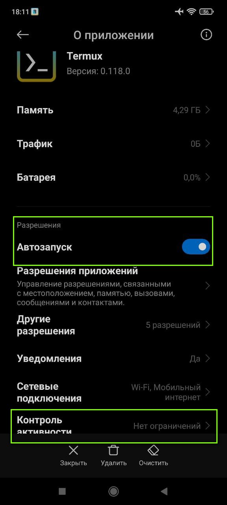
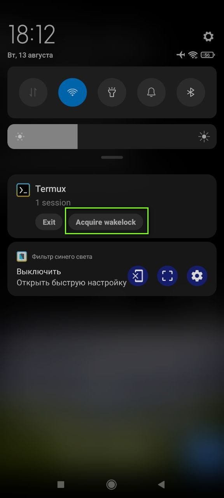
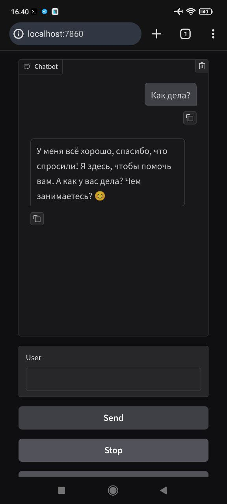
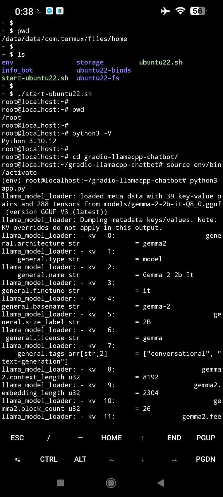
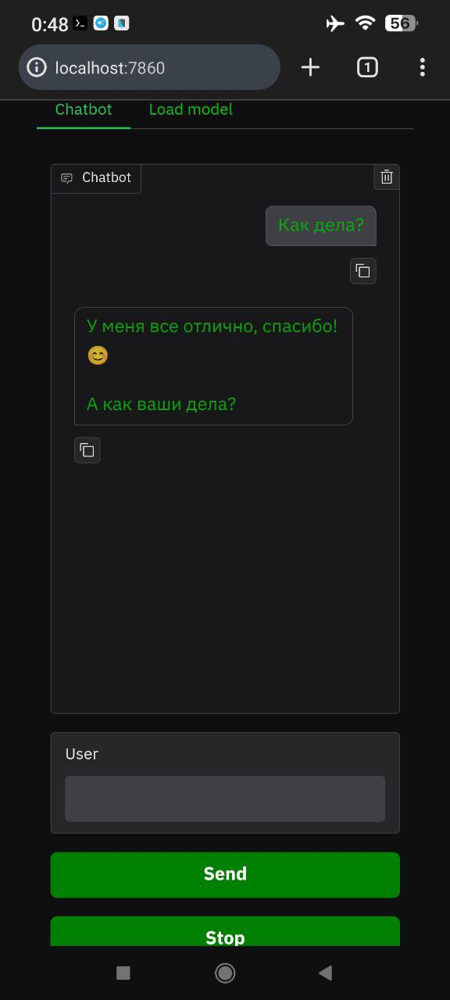
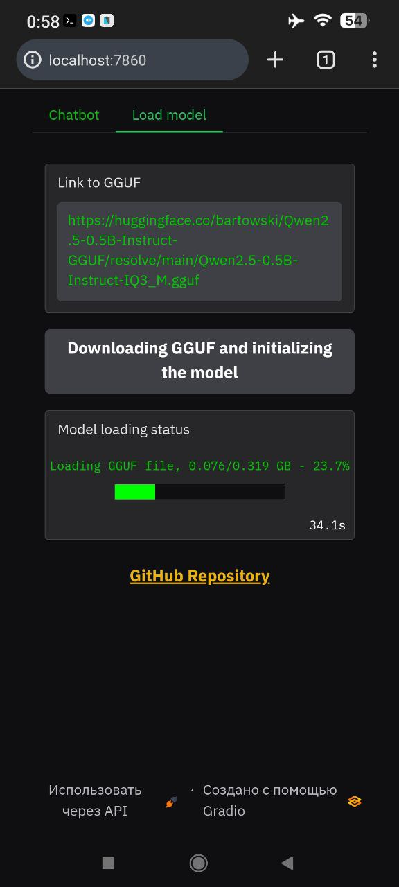
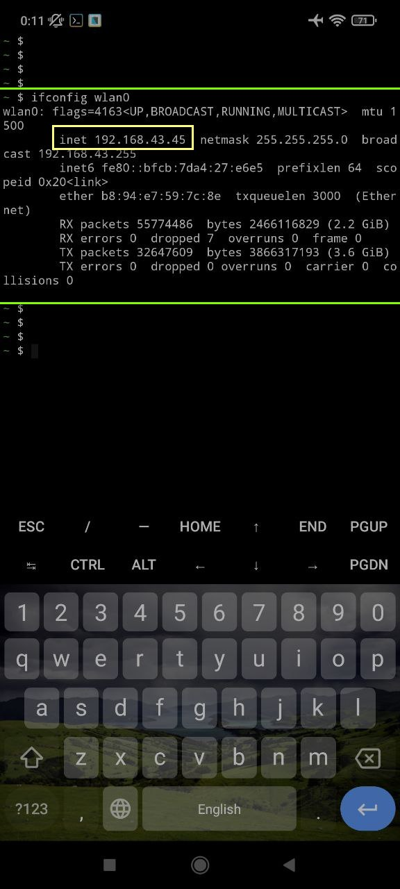
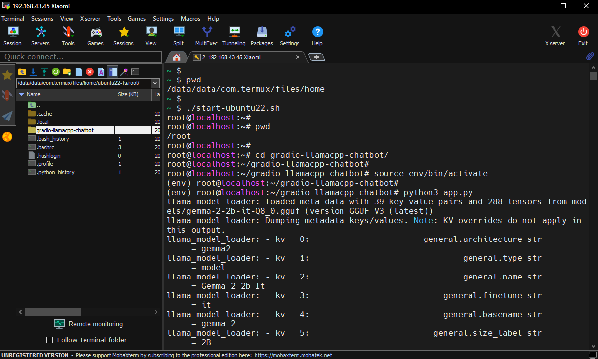

# 📱 Запуск бота на Android


## 📋 Содержание

- [Установка Termux на Android](#-установка-termux-на-android)
- [Сборка llama.cpp в Termux](#-сборка-llamacpp-в-termux)
  - [Подготовка](#подготовка)
  - [Сборка с поддержкой CPU](#сборка-с-поддержкой-cpu)
  - [Сборка с поддержкой GPU (Vulkan)](#сборка-с-поддержкой-gpu-vulkan)
  - [Проверка запуска llama.cpp](#проверка-запуска-llamacpp)
- [Запуск Python приложения в Termux](#-запуск-python-приложения-в-termux)
  - [Настройка переменных окружения](#настройка-переменных-окружения)
  - [Установка зависимостей через uv](#установка-зависимостей-через-uv)
  - [Запуск приложения](#запуск-приложения)
- [Вариант установки через Ubuntu (Andronix)](#-вариант-установки-через-ubuntu-andronix)
  - [Установка Ubuntu в Termux](#установка-ubuntu-в-termux)
  - [Сборка llama.cpp в Ubuntu](#сборка-llamacpp-в-ubuntu)
  - [Запуск приложения в Ubuntu](#запуск-приложения-в-ubuntu)
- [Подключение к телефону по SSH](#-подключение-к-телефону-по-ssh)
  - [Через Tabby + WinSCP](#через-tabby--winscp)
  - [Через терминал](#через-терминал)
  - [Через MobaXterm](#через-mobaxterm)
- [Ссылки](#-ссылки)


## Установка Termux на Android

**1) Загрузить и установить `Termux`**  

Загрузить `apk` файл с [GitHub](https://github.com/termux/termux-app/releases) или [Fdroid](https://f-droid.org/ru/packages/com.termux/)

**2) Выполнить команду чтобы дать доступ `Termux` к памяти телефона**

Запустить `Termux` и выполнить команду
```sh
termux-setup-storage
```
Выдать разрешение на доступ к памяти

Проверить что `Termux` имеет доступ к памяти телефона
```sh
ls storage
```
Если нет - долгий тап на значок приложения `Termux` - Инфо о приложении - Разрешения - отозвать и вернуть разрешение на доступ к памяти  
(или сделать все это в Настройки - Приложения)

**3) Установка базовых библиотек в Termux**
```sh
pkg update && pkg upgrade
pkg install tur-repo
pkg update
pkg install python python-pip python-numpy python-pillow python-pandas rust git nano openssh
```
Здесь `rust` необходим для компиляции многих библиотек, таких как pydantic-core, aiogram, orjson и др.  
Репозиторий `tur-repo` содержит множество заранее скомпилированных библиотек для `Termux`, в данном случае он нужен для установки `python-pandas`  
https://github.com/termux-user-repository/tur  

Такие библиотеки как `numpy`, `pillow` могут не установиться обычным способом через pip поэтому ставятся через pkg

Список библиотек из Termux Wiki здесь  
https://wiki.termux.dev/wiki/Python

Проверить есть ли библиотека в pkg можно через `pkg search`, например `pkg search uv`

**4) Настроить Android чтобы он не закрывал `Termux` (опционально, для случая если приложение будет деплоиться на телефоне)**

Для этого в зависимости от версии Android нужно найти все настройки, которые отвечают за закрытие приложения системой Android (оптимизация батареи, настройка работы программ в фоновом режиме)  
Например на Android 11 (MIUI 12) нужно удерживать тап на `Termux` - О приложении, включить автозапуск и установить Констроль активности - Без ограничений  

<details>
<summary>Скриншот Настроек Контроля активности</summary>

</details>

Так же в шторке уведомлений Android там где висит `Termux` нужно нажать `Acquire wakelock`, переключив таким образом `Termux` в режим в котором он не будет отключаться    
Еще можно нажать на недавние приложения - тап на окошко `Termux` и нажать на замок чтобы закрепить приложение  

<details>
<summary>Скриншот Acquire wakelock Termux</summary>

</details>


## Сборка llama.cpp в Termux

Документация по сборке llama.cpp
https://github.com/ggml-org/llama.cpp/blob/master/docs/build.md


### Подготовка

**1) Создание папки `libs` и переход в нее**

Для примера llama.cpp будет собираться в папку `libs` в домашней папке `Termux` (по умолчанию он открывается там)  
```
mkdir libs
cd libs
```
Полный путь получится такой
```
/data/data/com.termux/files/home/libs
```

**2) Установка библиотек для сборки llama.cpp в `Termux`**
```sh
pkg update
pkg install cmake clang git libandroid-spawn
```

**3) Клонирование репозитория llama.cpp**
```
git clone https://github.com/ggerganov/llama.cpp
cd llama.cpp
```


### Сборка с поддержкой CPU

**Вариант 1 - обычная сборка**
```sh
cmake -B build
cmake --build build --config Release --target llama-server -j 8
```
В процессе сборки могут появляться предупреждения  
В данной команде указано кол-во потоков `-j 8`, узнать кол-во потоков своего телефона можно командой
```
cat /proc/cpuinfo | grep processor | wc -l

# или
# lscpu -p | grep -c "^[0-9]"
```

**Вариант 2 - сборка с поддежкой оптимизации KleidiAI для процессоров ARM**
```sh
cmake -B build -DGGML_CPU_KLEIDIAI=ON
cmake --build build --config Release --target llama-server -j 8
```


### Сборка с поддержкой GPU (Vulkan)

Есть два варианта сборки - OpenCL и Vulkan
- OpenCL предназначен только для Adreno GPU (Qualcomm Snapdragon), и требует Android NDK для кросс-компиляции
- Vulkan поддерживается на большинстве современных Android GPU (Mali, Adreno, Dimensity) и является рекомендуемым вариантом для GPU-ускорения на Android — собирается прямо в Termux без NDK

Установка необходимых библиотек в `Termux`
```
pkg install vulkan-loader-android vulkan-headers vulkan-tools shaderc
```

Проверка версии vulkan
```
vulkaninfo | grep -E "deviceName|apiVersion"
```
- в deviceNme должно выводить устройство GPU - например Mali (если выводит `deviceName = llvmpipe` то это программый рендер, не аппаратный, и Termux не видит GPU)
- apiVersion должна быть 1.2 или выше, если ниже то llama.cpp не обнаружит GPU

Пример вывода
```
        apiVersion        = 1.2.1
        deviceName        = Mali-G76
```

Сборка llama.cpp с поддержкой Vulkan
```
cmake -B build -DGGML_VULKAN=ON
cmake --build build --target llama-server -j 8
```


### Проверка запуска llama.cpp

Проверка сборки
```sh
build/bin/llama-server --version
```

Должна появиться строчка вроде:
```sh
ggml_vulkan: Using Mali-G76
```

Добавить путь до `llama-server` в системную директорию `Termux` чтобы вызывать `llama-server` из любого места и указать путь к библиотекам  
Для этого открыть на редактирование файл `~/.bashrc`
```sh
nano ~/.bashrc
```

Дописать туда строки, указав соотвествующий путь до папки bin
```sh
export LD_LIBRARY_PATH="$HOME/libs/llama.cpp/build/bin:$LD_LIBRARY_PATH"
export PATH="$HOME/libs/llama.cpp/build/bin:$PATH"
```

Применить изменения
```sh
source ~/.bashrc
```

Запуск сервера llama.cpp - в данном примере модель в формате GGUF находится в папке `llama_cache`
```
llama-server --model llama_cache/bartowski_Qwen_Qwen3.5-0.8B-GGUF_Qwen_Qwen3.5-0.8B-Q4_K_M.gguf --ctx-size 2048
```
После запуска можно перейти по адресу http://127.0.0.1:8080 в браузере телефона чтобы воспользоваться llama.cpp WebUI  


## Запуск приложения в Termux

> [!IMPORTANT]
> В большинстве солучаев файлы проекта необходимо располагать не в смонтированной папке телефона  
`/data/data/com.termux/files/home/storage`  
а например в домашней папке  
`/data/data/com.termux/files/home`  
(иначе например uv не сможет создать виртуальное окружение или модели в формате GGUF будут очень долго загружаться)

**1) Создание папки проектов**

Для удобства сразу после открытия `Termux` в его домашней папке создается папка `projects`
```
mkdir -p projects
cd projects
```
Путь полный путь такой
```
/data/data/com.termux/files/home/projects
```

**2) Клонирование репозитория проекта**

```sh
git clone https://github.com/sergey21000/gradio-llamacpp-chatbot.git
cd gradio-llamacpp-chatbot
```

**3) Установка Python библиотек**

- Активация виртуального окружения и установка библиотек через Pip
  ```
  python -m venv .venv --system-site-packages
  source .venv/bin/activate
  export ANDROID_API_LEVEL=30
  pip install -r requirements.txt
  ```
  Флаг `--system-site-packages` нужен чтобы окружение видело например глобально установленные numpy, pandas

- Активация виртуального окружения и установка библиотек через UV
  ```
  uv venv
  source .venv/bin/activate
  export ANDROID_API_LEVEL=30
  uv pip install -r requirements.txt
  ANDROID_API_LEVEL=30 uv pip install -r requirements.txt --python-platform aarch64-linux-android
  ```

Установка ANDROID_API_LEVEL нужна для корректной установки библиотеки `orjson` (зависимость для `gradio`), иначе у меня выдало ошибку при установке

ANDROID_API_LEVEL=30 соотвествует Android 11, если потрербуется указать свой ANDROID_API_LEVEL, его можно узнать командой
```
getprop ro.build.version.sdk
```

**5) Запуск приложения**

Перед запуском приложения открыть файл настроек `.settings.env` и указать путь до скомпилированной на предыдущем этапе llama.cpp
```env
LLAMACPP_DIR=/data/data/com.termux/files/home/libs/llama.cpp/build/bin
```

Запуск приложения
```sh
python app.py
```

Перейти с любого браузера телефона по адресу `http://127.0.0.1:7860` 
Для остановки приложения ввести Ctrl + C на клавиатуре `Termux`

<details>
<summary>Открытие приложения а браузере и диалог с `google_gemma-3-1b-it-Q8_0.gguf`</summary>

</details>


## Вариант установки и запуска приложения через Ubuntu (Andronix)

Данная инструкция может пригодиться если какие либо из библиотек на устанавливаются на обычный Termux  


### Установка Ubuntu в Termux

**1) Установить Termux по инструкции выше**

**2) Установить программу `Andronix`, которая установит `Ubuntu` на `Android`**  

Загрузить и установить `Andronix` c [Play Market](https://play.google.com/store/apps/details?id=studio.com.techriz.andronix) или [4PDA](https://4pda.to/forum/index.php?showtopic=972503)
 
**3) Запуск `Andronix`**, выбор `Linux Distribution`, выбор `Ubuntu`, выбор `22.04`, выбор `CLI Only`.  
Произойдет копирование текстовой команды для установки `Ubuntu` в буфер обмена  

**4) Запуск `Termux`**, долгий тап по экрану - вставить скопированную команду, нажать `Enter`, начнется установка `Ubuntu` 

Например для установки Ubuntu 22.04 это будет следующая команда
```sh
pkg update -y && pkg install wget curl proot tar -y && wget \
https://raw.githubusercontent.com/AndronixApp/AndronixOrigin/master/Installer/Ubuntu22/ubuntu22.sh -O \
ubuntu22.sh && chmod +x ubuntu22.sh && bash ubuntu22.sh
```
После установки `Termux` автоматически перейдет в `Ubuntu`, о чем будет сигнализировать надпись в терминале  
`root@localhost: `  

> [!NOTE]  
Если нужно потом вручную запускать `Ubuntu`, нужно просто ввести в Termux `./start-ubuntu22.sh`, этот скрипт появляется после установки `Ubuntu` (если ставили другую ОС то будет называться соотвественно)  
Чтобы выйти из `Ubuntu` обратно в `Termux` - ввести `exit`  
Сама папка с `Ubuntu` лежит там же где и скрипт, в папке  
`/data/data/com.termux/files/home/ubuntu22-fs/`  
Для удаления `Ubuntu` выбрать ее в интерфейсе `Andronix` долгим тапом и выбрать `Uninstall`, затем вставить скопированную команду в `Termux` и выполнить

`Ubuntu` запущена и готова к работе, можно ставить необходимые пакеты
```sh
apt update
apt install git curl wget nano
```

<ins><b>Все дальнейшие команды вводить в `Ubuntu`</b></ins>


### Сборка llama.cpp в Ubuntu

**1) Установка библиотек для сборки**
```
apt update
apt install -y cmake clang git build-essential libssl-dev
```

**2) Клонирование репозитория llama.cpp**
```
git clone https://github.com/ggerganov/llama.cpp
cd llama.cpp
```

**3) Сборка llama.cpp**

- Вариант 1 - обычная сборка
  ```sh
  cmake -B build
  cmake --build build --config Release --target llama-server -j $(nproc)
  ```

- Вариант 2 - сборка с поддежкой оптимизации KleidiAI для процессоров ARM
  ```sh
  cmake -B build -DGGML_CPU_KLEIDIAI=ON
  cmake --build build --config Release --target llama-server -j $(nproc)
  ```

**4) Проверка сборки**
```sh
build/bin/llama-server --version
```

**5) Добавление путей до llama.cpp в систему**

Добавить путь до `llama-server` в системную директорию `Termux` чтобы вызывать `llama-server` из любого места и указать путь к библиотекам  
Для этого открыть на редактирование файл `~/.bashrc`
```sh
nano ~/.bashrc
```

Дописать туда строки, указав соотвествующий путь до папки bin
```sh
export LD_LIBRARY_PATH="/root/llama.cpp/build/bin:$LD_LIBRARY_PATH"
export PATH="/root/llama.cpp/build/bin:$PATH"
```

Применить изменения
```sh
source ~/.bashrc
```


### Запуск приложения в Ubuntu

**1) Клонирование репозитория проекта**
```sh
git clone https://github.com/sergey21000/gradio-llamacpp-chatbot.git
cd gradio-llamacpp-chatbot
```

**2) Установка Python и библиотек на Ubuntu**  

Установка Python, активация виртуального окружения и установка библиотек

- Вариант через Pip
  ```
  apt install -y python3-pip python3-venv
  python3 -m venv .venv
  source .venv/bin/activate
  pip install -r requirements.txt
  ```

- Вариант через UV
  ```
  wget -qO- https://astral.sh/uv/install.sh | sh
  source $HOME/.local/bin/env
  uv python install 3.12
  uv venv
  source .venv/bin/activate
  UV_LINK_MODE=copy UV_NO_CACHE=1 uv pip install -r requirements.txt
  ```

**3) Запуск приложения**

Перед запуском приложения открыть файл настроек `.settings.env` и указать путь до скомпилированной на предыдущем этапе llama.cpp (открыть можно например командой `nano .settings.env`)
```env
LLAMACPP_DIR=/root/llama.cpp/build/bin
```

Запуск приложения
```sh
python3 app.py
```

Перейти с любого браузера телефона по адресу `http://127.0.0.1:7860`  
Для остановки приложения ввести Ctrl + C  
Чтобы выйти из `Ubuntu` обратно в `Termux` - в терминале ввести `exit`  
Чтобы заново открыть `Ubuntu` из `Termux` - в терминале ввести `./start-ubuntu22.sh`  


<details>
<summary>Запуск Ubuntu из терминала `Termux` и запуск приложения</summary>

</details>

<details>
<summary>Открытие приложения а браузере и диалог с `gemma-2-2b-it-Q8_0.gguf` (2.7 Gb)</summary>

</details>

<details>
<summary>Страница загрузки моделей GGUF</summary>

</details>


### (New) Подключение из ПК к телефону по SSH через Tabby + WinSCP

> [!NOTE]  
Даныый способ подключения ПК к телефону проверялся недавно и является актуральным, остальные давно не проверялись (но проблем быть не должно)

**1) Установка Tabby и WinSCP**

Страница Tabby (удобный терминал)  
https://tabby.sh/  
Страница WinSCP (удобный проводник)  
https://winscp.net/eng/download.php  

**2) Создание SSH ключей если их еще нет**
```powershell
ssh-keygen -t ed25519 -f ~\.ssh\id_ed25519_phone
```
Путь и название ключа можно указать любой  
Будут созданы два ключа, приватный и публичный, например для Windows они будут лежать тут
```powershell
C:\Users\ИМЯ_ПОЛЬЗОВАТЕЛЯ\.ssh\id_ed25519_phone
C:\Users\ИМЯ_ПОЛЬЗОВАТЕЛЯ\.ssh\id_ed25519_phone.pub
```

**3) Копирование публичного SSH ключа на телефон**
На ПК вывести содержимое ключа любым удобным способом, например через текстовый редактор или здесь же в терминале сразу после создания
```powershell
cat ~/.ssh/id_ed25519_phone.pub
```
Затем скопировать его и переслать на телефон, наприер через какой либо месседжер  
Затем скпировать его на телефоне, открыть Termux и записать туда скопированное содержимое
```
nano ~/.ssh/authorized_keys
```
Удерживаем тап по экрану - вставляем содержимое, и с помощью клавиатуры `Termux` нажимаем `Ctrl+S` и `Ctrl+X`

**4) Перезапуск службы SSH в `Termux`**
```sh
pkill sshd
sshd
```

**6) Узнать имя пользователя и IP адрес телефона Android**
Поочередно вводим в `Termux` для получения имени пользователя и IP
```sh
whoami
ifconfig
```
IP адрес написан в разделе `wlan0`, после слова `inet`, например `192.168.43.45`  
Название может быть другое, например `wlan1` и тд  
Можно сразу посмотреть инфо о `wlan0` командой
```sh
ifconfig wlan0
```

**7) Подключение из ПК с телефону через Tabby**

На ПК открываем Tabby и для удобства сразу создаем профиль соединения чтобы потом было удобно подключаться - нажимаем на шестеренку настроек - Профили и Соединения - Новый - Новый профиль - SSH соединение  
Заполняем 
- `Хост` который получили на предыдущем шаге командой ifconfig (например `192.168.43.45`) 
- `Порт` 8022
- `Имя пользователя` из предыдущего шага из команды whoami
- `Метод аутентификации`- `Ключ`
- В разделе `Приватные ключи` - `Добавить Приватный ключ` указывам путь до закрытого ключа SSH (например `C:\Users\ИМЯ_ПОЛЬЗОВАТЕЛЯ\.ssh\id_ed25519_phone`)

Внизу нажимаем `Сохранить`, еще можно заполнить раздел `Имя` для установки названия соединения  
Закрываем окно и теперь в разделе `Настройки` - `Профили и соединения` есть наше соединение - нажимаем на значок запуска (значок Play)

**7) Как открыть WinSCP**
В Tabby (при активном соединении) нажать ПКМ на активную вкладку терминала - `Запустить WinSCP`  
WinSCP должен автоматически открыть проводник, при этом никаких больше действий не требуется  
Если не работает - открыть настроки Tabby - `SSH` - `Путь к WinSCP` и укзать путь до программы (например `C:\Users\ИМЯ_ПОЛЬЗОВАТЕЛЯ\Desktop\Programs\WinSCP\WinSCP.exe`)


### Подключение из ПК к телефону по SSH через терминал

**Подключение из ПК к телефону по SSH через терминал**  

[Документация](https://wiki.termux.com/wiki/Remote_Access) и [статья](https://axenov.dev/termux-настроить-доступ-по-ssh-между-android-и-ubuntu/) по удаленному подключению к `Termux` 

> [!NOTE]  
Пк и телефон должны быть подключены к одной сети  
IP адрес телефона может динамически меняться при новых подключениях  

**1) Установка SSH и редактора nano на `Termux`**
```sh
pkg install nano openssh
```

**2) Генерация SSH ключей на ПК**
```sh
ssh-keygen
```
Далее нажимать `Enter` пока не будет написано что ключи сгенерированы  
Ключи представляют из себя публичную `id_rsa.pub` и приватную `id_rsa` части  
Приватный ключ никому не надо показывать, публичный ключ можно показывать кому угодно и его содержимое нужно будет скопировать на телефон  
Ключи сохраняются на Windows по пути `C:\Users\ИМЯ_ПОЛЬЗОВАТЕЛЯ\.ssh\`  
Ключи сохраняются на Linux по пути `~/.ssh/`  

**3) Вывести содержимое публичного ключа `id_rsa.pub` на ПК**

Команда для Windows PowerShell или Linux
```sh
cat ~/.ssh/id_rsa.pub
```

**4) Скопировать содержимое ключа и любым удобным способом перекинуть на телефон (например через Избранное Telegram)**  
Затем в телефоне скопировать содержимое и вставить его в файл `~/.ssh/authorized_keys` в телефоне  
Для этого в терминале `Termux` открываем редактор nano
```sh
mkdir -p ~/.ssh
nano ~/.ssh/authorized_keys
```
Удерживаем тап по экрану - вставляем содержимое, и с помощью клавиатуры `Termux` нажимаем `Ctrl+S` и `Ctrl+X`

**5) Остановка и запуск службы SSH в `Termux`**
```sh
pkill sshd
sshd
```

**6) Узнать IP адрес телефона Android**
```sh
ifconfig
```
IP адрес написан в разделе `wlan0`, после слова `inet`, например `192.168.43.45`  
Название может быть другое, например `wlan1` и тд  
Можно сразу посмотреть инфо о `wlan0` командой
```sh
ifconfig wlan0
```

**7) Подключение из ПК с телефону - к IP адресу который узнали командой выше**
```sh
ssh 192.168.43.45 -p 8022
```
Если появится предложение ввести имя пользователя (`login as:`) - оставить пустым и нажать `Enter`

Перед подключением убедиться что служба SSH в `Termux` запущена (нужно запускать ее при каждом перезапуске `Termux`)
```sh
sshd
```

**8) Отключить авторизацию по паролю в `Termux` чтобы можно было подключаться только через SSH (опционально)**  
```sh
nano $PREFIX/etc/ssh/sshd_config
```
Добавить или редактировать строку
```
PasswordAuthentication no
```

*Дополнительные команды*  

Отключиться от телефона
```sh
exit
```
Завершить работу службы SSH в `Termux`
```sh
pkill sshd
```

<details>
<summary>Скриншот команды `ifconfig wlan0` с IP адресом телефона</summary>

</details>


### Подключение из ПК к телефону по SSH через MobaXterm

**Подключение к телефону через SSH через с помощью программы MobaXterm с файловым менеджером**

> [!NOTE]  
Пк и телефон должны быть подключены к одной сети  
IP адрес телефона может динамически меняться при новых подключениях  

---
Установить на ПК [MobaXterm](https://mobaxterm.mobatek.net/)

Как узнать IP адрес телефона и создать SSH ключи описано в предыдущем разделе  
Там же описано как переместить публичную часть ключа в телефон - это необходимо для подключения

**Процесс подключения**

В левом верхнем углу программы нажать на `Session` -> `SSH` -> в поле `Remote host` вбить IP адрес телефона, в поле `Port` - 8022  
Перейти на вкладку `Advancrd SSH settings` -> поставить галку на `Use private key` -> нажать на значок выбора файла и указать путь к приватному ключу (например `C:\Users\ИМЯ_ПОЛЬЗОВАТЕЛЯ\.ssh\id_rsa`)  
Затем нажать ок и будет произведена попытка подключения  
Во вкладке `Bookmark settings` можно задать удобное название для подключения (опционально)  

<details>
<summary>Запуск приложения через MobaXterm</summary>


</details>


### Ссылки

Страница `Termux` на 4PDA c различными инструкциями по программе  
https://4pda.to/forum/index.php?showtopic=741456  
Полезное про `Termux`  
https://4pda.to/forum/index.php?showtopic=1009922  

Статья `Код доступа Termux`  
https://habr.com/ru/articles/652633/

Советы по установке библиотек в `Termux` + установка numpy и pandas  
https://github.com/termux/termux-packages/discussions/19126

`Termux` с рабочим столом с поддержкой аппаратного ускорения и прочего  
https://github.com/sabamdarif/termux-desktop  
https://github.com/LinuxDroidMaster/Termux-Desktops  

Страница `Andronix` на GitHub  
https://github.com/AndronixApp/AndronixOrigin

Документация `Andronix`  
https://docs.andronix.app/unmodded-distros/unmodded-os-installation

Ветка `Andronix` на 4PDA c различными инструкциями по программе  
https://4pda.to/forum/index.php?showtopic=972503

Статья `Устанавливаем рабочий стол Linux на Android` с альтернативами `Andronix`  
https://habr.com/ru/articles/495720/

Установка Linux в Android через PRoot Distro  
https://github.com/termux/proot-distro  
```
pkg update
pkg install proot-distro
proot-distro install ubuntu
proot-distro login ubuntu
```
